<p align="center"><a href="README.md">English</a> · <strong>简体中文</strong></p>

# BridgeFlow AI

BridgeFlow 读的是生产、采购、财务、市场四个部门各自维护的月度表格，产出的是一个不可变批次，
加上一份能自证的业务研判报告。它跑在官方 DeepSeek Harness 上：原生 Web、会话、审批、四个并发子代理。
字典里声明了什么算术，就由 Python 算什么；每个部门只在自己的职责内提建议，主机逐条校验结构化结果，
通过了才会落进报告。

这份 README 是一份**照着做就能跑通的操作指引**。从上到下走完，你会在一台没用过的机器上把产品跑起来、
完整做完一次研判、并亲手处理一次映射审批。除了「你会打开终端」，不假设任何前提。

- [现在做到了什么、还没做什么](#现在做到了什么还没做什么)
- [开始之前](#开始之前)
- [1 准备机器](#1-准备机器)
- [2 安装](#2-安装)
- [3 配置启动环境](#3-配置启动环境)
- [4 构建插件](#4-构建插件)
- [5 启动](#5-启动)
- [6 认识工作面](#6-认识工作面)
- [7 最快的完整闭环](#7-最快的完整闭环示例笔记本)
- [8 导入自己的文件](#8-导入自己的文件)
- [9 发起研判](#9-发起研判)
- [10 读报告，把一个数字追到底](#10-读报告把一个数字追到底)
- [11 人在环内：映射审批](#11-人在环内映射审批)
- [12 保存、离开、再回来](#12-保存离开再回来)
- [13 报价工作区](#13-报价工作区)
- [14 检查安装是否健康](#14-检查安装是否健康)
- [15 出问题的时候查这里](#15-出问题的时候查这里)
- [16 例题：从题目到答案](#16-例题从题目到答案)
- [真正的文档在哪里](#真正的文档在哪里)

## 现在做到了什么、还没做什么

| 部分 | 状态 | 看哪里 |
| --- | --- | --- |
| 月度对账：导入四部门文件、清洗、隔离、生成主表 | 已实现 | 第 7–8 节 |
| 按业务方 v2 模板与字典生成跨部门总表，每个单元格回指出处 | 已实现 | 第 7 节 |
| 四个部门子代理研判当月，结构化、带证据、宿主校验 | 已实现（真实模型运行记录在 `docs/00`） | 第 9–10 节 |
| 列匹配与隔离行处置走原生审批 | 已实现 | 第 11 节 |
| 新手产品导览 | 已实现 | 第 6 节 |
| 按声明政策出报价草稿 | 只有声明与模拟样板；不从真实文件抽取，不外发 | 第 13 节 |
| 填报与流转（Agent 2 基座）：带人补问、审批、交接看板 | 基座与只读看板；没有下游操作，没有真实通知 | 第 13 节 |
| 工作流生成（Agent 1）：候选场景、信息流/文件流图、字段血缘图、四象限、MVP 决策 | **未实现**，计划见 [`HANDOFF.md`](HANDOFF.md) | — |
| 组织落地（Agent 3）：上手指引、一线反馈、复盘 | **未实现**，只有从事件日志产出的落地信号 | — |
| 飞书上传/下载快捷调用 | 代码与模拟租户测试；未连接真实租户 | [`docs/27`](docs/27-external-inputs.md) |

所有示例数据都是虚构的。真实客户导出、业务方对按通用做法补齐的口径的确认，以及真正的留出验收都还没有。

## 开始之前

**这是什么。** 一个为黑客松做的业务用例演示。屏幕上的数据是生成的、明确标了合成的。
它不是企业部署：没有员工 SSO、没有角色与租户隔离、没有正式报表签发。当前认证表示一个共享 DSH 会话，
记录为 `dsh-authenticated-session`。

**什么会花钱。** 导入文件、算主表是确定性的，不花钱。发起研判会把请求发给配置的模型，那会计费。
示例案例一次研判耗时几十秒、消耗几万 token；实测数字只在
[`docs/00-status.md`](docs/00-status.md) 记一次，别处都是链接。

**关于截图。** 界面标签跟随 DSH 的语言设置，所以下面多数截图来自中文界面的复演，最后一张是英文。
对照表：来源 = Sources、工作室 = Studio、对话 = Chat、轨迹 = Trajectory、业务状态 = Business state、
发起研判 = Start the review、主表 = Master table、待确认映射 = Mappings awaiting confirmation、
隔离行 = Quarantined rows、清洗记录 = Cleaning log、添加来源 = Add sources、
打开示例笔记本 = Open sample notebook、新建笔记本 = Create notebook、保存笔记本 = Save notebook、
退出笔记本 = Exit notebook、会话与设置 = Sessions & settings、允许一次 = Allow once、拒绝 = Reject、
拒绝理由 = Rejection reason。有三张截图仍是上一版外壳（对话｜轨迹｜业务状态），不是三栏笔记本，
出现的地方都单独标了；每张图的来源记录在 [`docs/images/README.md`](docs/images/README.md)。

## 1 准备机器

Linux 与 WSL2（Ubuntu）都可以。Windows 请用 WSL2，并读
[`docs/14-wsl-setup.md`](docs/14-wsl-setup.md)，那份把每一步都配了一条验证命令。

一条规矩能省几天：所有东西都放在 Linux 文件系统里（`/home/...`），**不要放 `/mnt/...`**。
跨 `/mnt` 时 inotify 会静默失效、权限位丢失、IO 慢一个量级，同一个运行时启动要慢好几秒。

这份指引假设的目录布局：

```text
~/Hackathon2026/
├── BridgeFlow-AI/     仓库（只放源码）
├── .venv/             Python 虚拟环境，故意放在仓库外
└── .dsh-bridgeflow/   DSH_HOME，在仓库外，也在你日常那套 dsh 之外
```

虚拟环境和 DSH_HOME 放在仓库外，是为了不可能被误提交。分界线：源码进仓库，运行时状态不进。

## 2 安装

```bash
mkdir -p ~/Hackathon2026 && cd ~/Hackathon2026
gh repo clone EricWang1358/BridgeFlow-AI      # 私有仓库：先执行 `gh auth login -s project`
                                              # 没装 gh 就用 `git clone https://github.com/EricWang1358/BridgeFlow-AI`，需要 token
cd BridgeFlow-AI

python3.12 -m venv ../.venv && source ../.venv/bin/activate
pip install -U pip
cd backend && pip install -e ".[dev]" && cd ..

npm install -g @deepseek-ai/dsh@0.1.2-rc.1    # 用锁定的 npm CLI，不要用 Python 打包的那个二进制
```

虚拟环境建在 `~/Hackathon2026/.venv`（注意是在仓库目录里执行、装到上一级）。这份指引后面的每条命令
都默认你在当前 shell 里跑过 `source ../.venv/bin/activate` 和 `source ./env.sh`；
新开一个终端窗口，这两句要重来一遍。

验证：

```bash
python -c "import bridgeflow, pandas, fastapi, deepseek_harness; print('imports ok')"
dsh --version
```

项目实际跑 Python 3.12（`requires-python = ">=3.11"`，因为代码用了 `datetime.UTC`）。
只跑 Python SDK 不需要系统装 Node.js，但要写 TS 插件就需要 npm 与 pnpm。

## 3 配置启动环境

```bash
cp env.sh.example env.sh
$EDITOR env.sh        # 填 DEEPSEEK_API_KEY；DSH_HOME 若不用默认值也在这里改
source env.sh
```

| 变量 | 作用 |
| --- | --- |
| `DSH_HOME` | dsh 存放 profile、插件、凭据与会话的位置。必须绝对路径，且在仓库外。必填：SDK 刻意不去发现 `~/.dsh` |
| `DSH_PROFILE` / `DSH_PROVIDER` / `DSH_MODEL` | 运行时用哪个组合、哪个 provider、哪个模型 |
| `DEEPSEEK_API_KEY` | 模型凭据 |
| `FIELD_DICTIONARY_PATH` | 领域字典：哪个部门的哪一列装哪类实体、什么可以被算、怎么折叠 |

`DSH_*` 与 `DEEPSEEK_BASE_URL` 只能由启动 shell 导出。dsh 会扫描它工作目录下的 `.env`
并拒绝从文件里读这些变量，这是安全边界：如果一份随仓库携带的文件能决定代码从哪里加载、网络去往哪里，
clone 一个恶意仓库就够了。不要绕过它（比如改运行时的工作目录）。空行 `DEEPSEEK_BASE_URL=`
也算「已设置」。

`FIELD_DICTIONARY_PATH` 默认指向 `data/mappings/field-dictionary.yaml`。那个文件被 gitignore，
装的是真实主数据，所以新 clone 出来的机器上没有；此时产品会明确说「未配置」，不会猜。
要跟着这份指引走示例案例，要么用 `--demo` 启动（见第 5 步），要么显式导出：

```bash
export FIELD_DICTIONARY_PATH=data/mock_business/demo/dictionary.yaml
```

## 4 构建插件

```bash
cd plugins
pnpm install --frozen-lockfile
pnpm run build
cd ..
```

Client 产物必须在 Web 启动之前存在；如果它比源码旧，启动器会告诉你。

## 5 启动

```bash
python scripts/start_web.py --demo --port 3082
```

`--demo` 把领域服务指向示例案例自己的字典，并打印它冻结了哪一份：

```text
BridgeFlow field dictionary: /home/you/Hackathon2026/BridgeFlow-AI/data/mock_business/demo/dictionary.yaml
```

启动器会拉起一个只监听 localhost 的私有 Python 服务（8000 端口）和你指定端口上的官方 `dsh web`，
并打印一个带一次性凭证的地址：**在浏览器里打开它**。`Ctrl-C` 会停掉它自己起的两个进程。

为什么强调 `--demo`：这个案例只在自己的字典下成立。它是唯一声明了 finance 可连接列
（`project`）和 `business_review` 契约的字典。用默认字典的话，导入仍然会成功、批次回
`needs_configuration`、研判被拒绝：第 1 步过，第 2 步不可能。这是设计如此——
系统说明缺什么，而不是编一个 join 键出来。

## 6 认识工作面

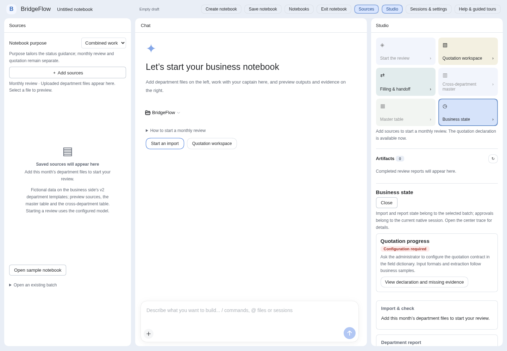

三栏，各自的分工就是这个产品的结构：

| 栏 | 装什么 | 归谁 |
| --- | --- | --- |
| 左 · 来源 Sources | 这个笔记本实际上传的文件，可预览 | BridgeFlow 面板 |
| 中 · Chat | 原生 DSH 会话、输入框与审批 | DSH，未改动 |
| 右 · 工作室 Studio | 上方是领域工具，下方是已保存产物，再下面是预览 | BridgeFlow 面板 |

顶栏从左到右：新建笔记本（开一个有自己来源的新会话）· 保存笔记本（显式，不会悄悄保存）·
笔记本（列表与恢复）· 退出笔记本 · 来源 / 工作室（显示或隐藏两侧面板）· 会话与设置（原生抽屉，
会话与设置仍归宿主）。

来源栏顶部的「笔记本用途」决定右栏显示哪套状态指引：月度对账、报价，或综合工作。
月度对账与报价是两条并列路径，选一个不会关掉另一个。

分隔线可以拖动，聚焦后用方向键微调，双击恢复默认。栏宽偏好只存在浏览器里。

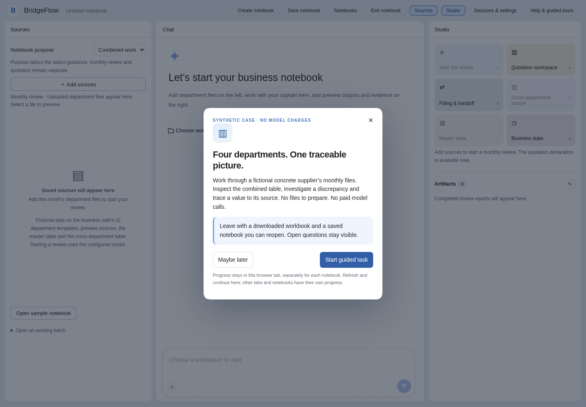

第一次打开工作面会弹出欢迎卡，带你做一次真实任务：打开示例笔记本、读跨部门总表、把一个数字追到原件、
下载总表、保存笔记本。每一步只有真实操作成功后才会前进。顶栏「Help & guided tours」可以继续、重播，
或者看部门研判和报价的说明。导览只覆盖月度对账，还没实现的工作流功能不在里面。

## 7 最快的完整闭环：示例笔记本

点左栏的「打开示例笔记本」。它会导入一家虚构商砼公司 `2024-07` 的四份部门工作簿（按业务方 v2 模板填写），
走正常的导入与规则计算，并为这个批次冻结示例字典。**这一步不调用模型**，所以不花钱。

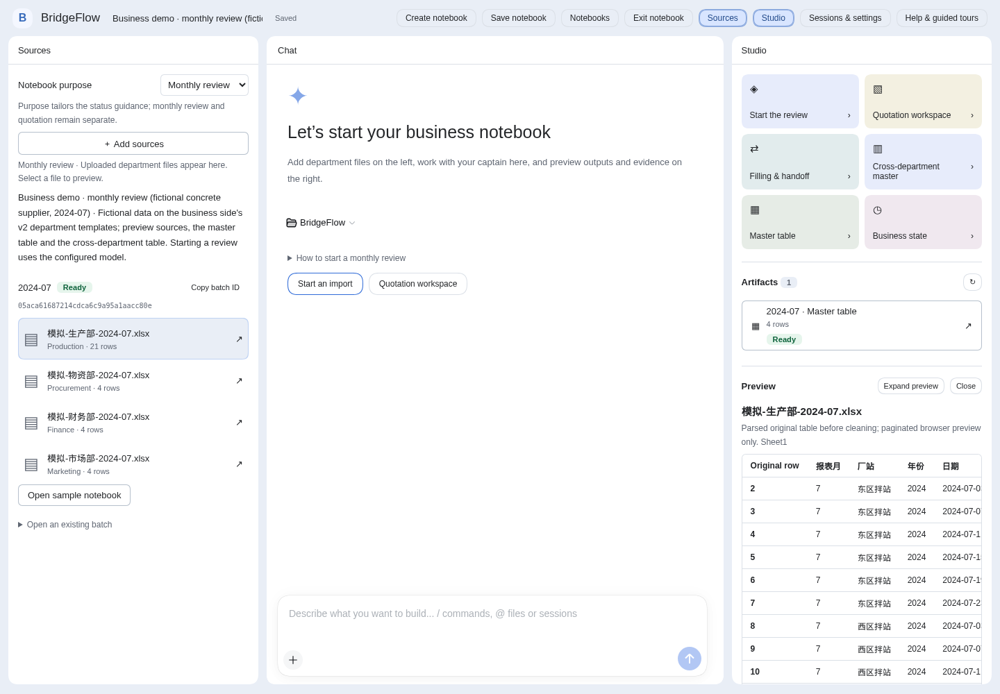

你应该看到：

1. 左栏：四份来源，`模拟-生产部-2024-07.xlsx`（按日填报 21 行），物资、财务、市场各 4 行（每个项目一行），
   业务月份 `2024-07`、「就绪」标记和批次编号。
2. 右栏：产物区里有一条 `2024-07 · 主表`，4 行。
3. 预览区：选中来源的解析视图，含原始行号与原始列名。

展开文件来源信息能看到这份预览属于哪个文件、哪个批次、哪个工作表、SHA-256 是多少。

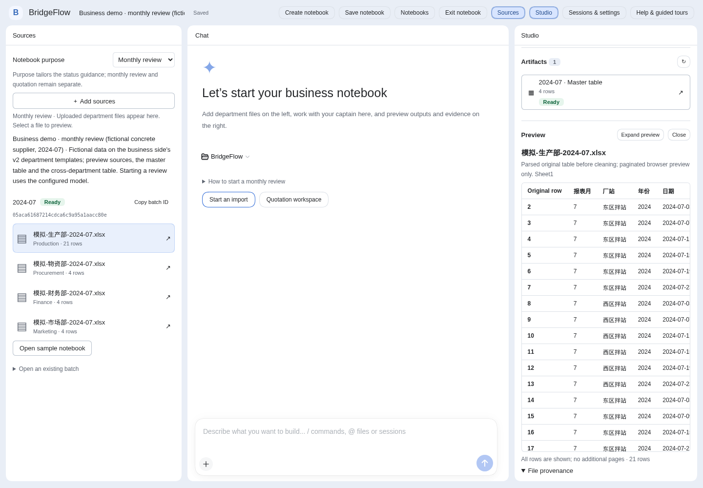

### 跨部门总表

点工作室里的「跨部门总表」。

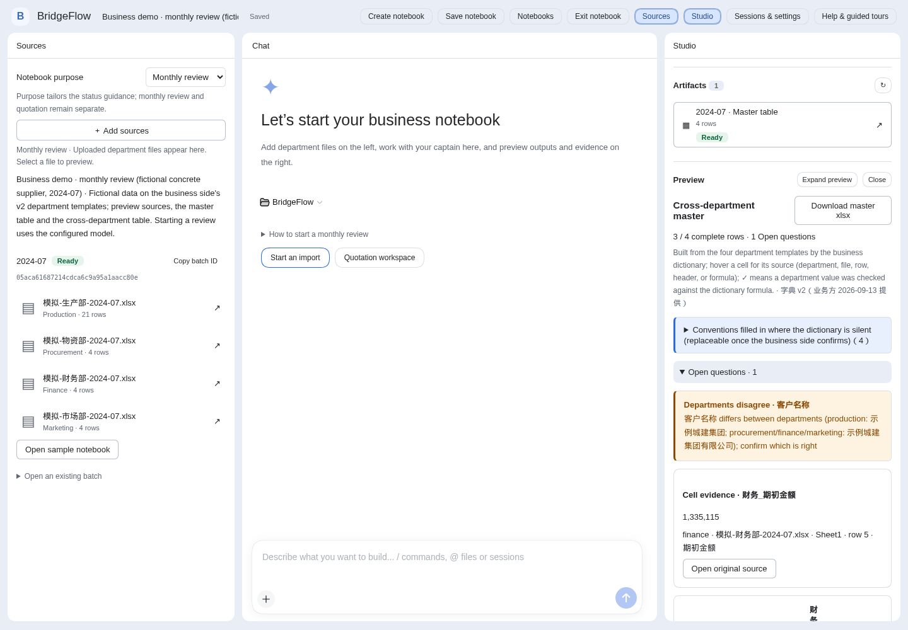

这是业务方设计的 76 列总表，严格按他们的字典 v2 从四部门模板生成：按项目编号、客户代码、报表年月对齐；
字典写明的公式会计算，并与部门填写值核对；字典没写的不替你编。

- **4 行里 3 行完整、1 条待确认。** 生产部把一个项目的客户名写成了简称。这个单元格留空，
  待确认项列出各部门分别怎么写，由人决定，系统不替部门选。
- **字典没写、按通用做法补的口径（4 条）。** 增值税 13%、收款缺口公式、客户合作状态诊断阈值、生产部按日汇总。
  每条都写在 `data/company_templates/integration.yaml`，依赖它的单元格都带说明，等业务方确认或替换。
- 点一个数字看它的出处：部门、文件、工作表、行号、表头，或公式与输入。「打开原件」显示上传文件里的那一行；
  「下载总表 xlsx」导出总表，另附待确认页和口径假设页。

### 批次数据

接着打开主表：点产物，或工具区里的「主表」。

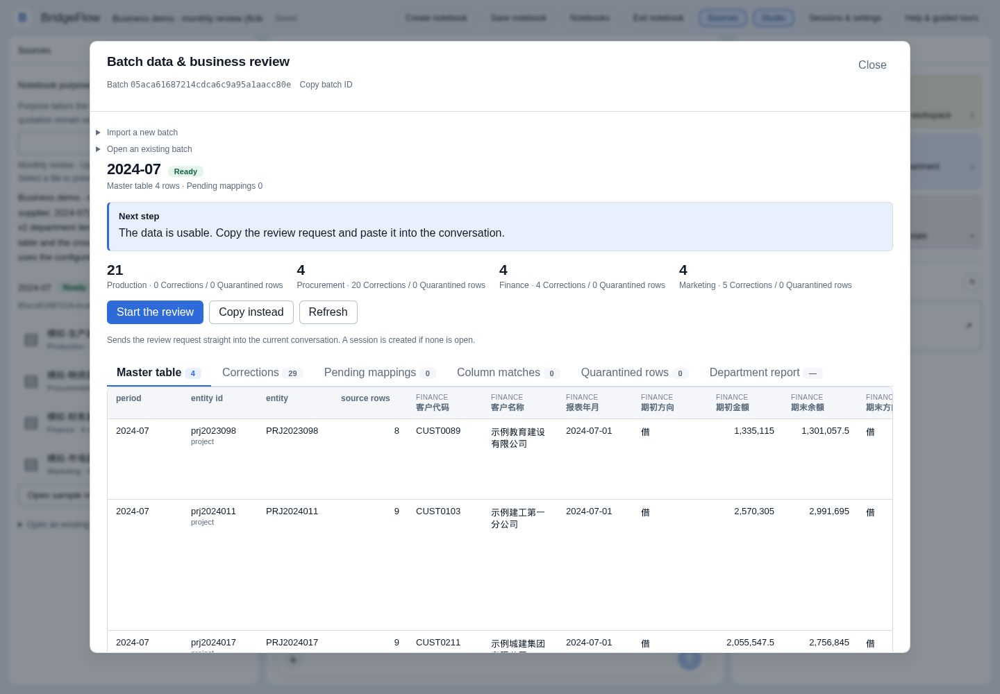

批次弹窗是判断「这批数据能不能拿去研判」的地方：

- **主表**：一张对齐的宽表，按字典声明为可连接的列 join。`rollups` 列显示多行是怎么折叠的——
  折叠是声明出来的决定，不是缺省。
- **清洗记录**：每一处修复，含原值、新值、规则与置信度。
- **待确认映射**：低于置信阈值的待确认关系，等人。「待确认」不等于「错了」。
- **隔离行**：系统拒绝猜测的行。有隔离行的批次会拒绝报总额，就是截图里那块黄色「下一步」。
- 按钮：「发起研判」把请求送进当前会话；「改一改再发（复制）」是先复制出来自己改；「刷新」。

## 8 导入自己的文件

用 `data/mock_business/monthly/` 下的部门工作簿（虚构公司三个月，6、7 月故意留了填报错误），或者按 `data/company_templates/source/` 模板填写的自己的文件。

1. 在来源栏点「添加来源」。
2. 选业务月份（`2024-07`）和部门文件。一个部门一份，CSV 或 XLSX。工作簿有多个工作表，或表头不在第 1 行
   （比如业务方 v1 物资部模板表头上方有合并标题行），导入会拒绝并列出工作表名或指出疑似表头行；
   在该文件的「表格位置（可选）」里填上，或在字典里声明 `sheet_layout`。
3. 点「导入并检查」。批次编号出现在左栏，要在对话里引用就先复制下来。
4. 打开批次弹窗，先把四个页签看一遍，再往下走。

一个坏格子会把批次带到哪里，不是假设：见[第 16 节例 5](#16-例题从题目到答案)。

总字节、解压后大小、部门数量与行数都有上限。浏览器可以翻页看数据；模型永远拿不到原始行，
只有计数、公式与封顶的证据样本。看得见一页数据是查看能力，不是性能验收。

如果批次回 `needs_configuration`，说明字典没为某个部门声明可连接列。
「为什么主表是空的」下面会打印这批冻结的是哪份字典；如果那不是你想要的文件，问题就在这儿。

## 9 发起研判

点「发起研判」。请求会进入当前会话，所以你能在「对话」和「轨迹」里看到全过程。**这一步会调用配置的模型，
会计费。**

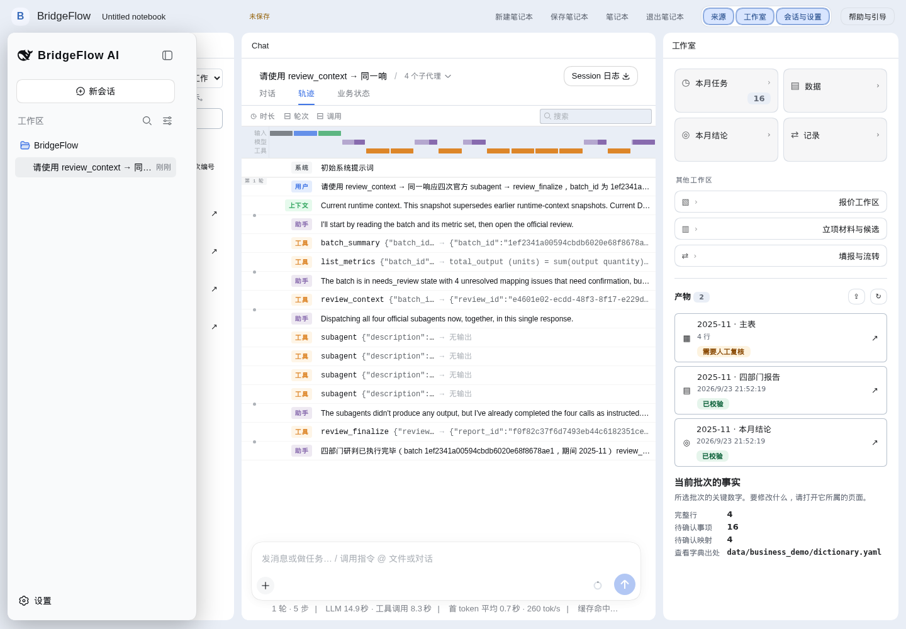

*这张是 2026-09-06 那版外壳（对话｜轨迹｜业务状态）拍的；工具序列与卡片内容在三栏外壳下一样。*

按顺序发生的事：

1. `review_context` 读取冻结的批次数据包，签发四张一次性派活票据。
2. 队长模型在**同一条响应里**调用四次官方 `subagent` 工具，description 分别是
   production、procurement、finance、marketing。顶栏出现四个子会话，各有各的会话编号，
   时间线上它们真的重叠。
3. 每个子代理只能提交 `structured_output`。它没有 shell、没有编辑器、不能执行代码、
   和其他三个没有通信通道，也读不到父会话历史与原始工作簿。
4. `review_finalize` 只从宿主记录的真实子会话结果里收集。父模型不能自己写四份判断冒充子代理。
5. Python 按冻结字典逐条复核数值、单位、状态、动作与引用。任何一条不过，那个部门就是 unvalidated，
   整份报告是 `partial`。

某部门连续产出无效结构时会被步骤上限（3 步）截停。报告随后如实写明「该部门没有有效判断」，
保留其余三个部门，不补一个假判断顶上。

这一整轮的完整例题（先手算再对答案）在[第 16 节例 1](#16-例题从题目到答案)，
失败路径在[例 6](#16-例题从题目到答案)。

## 10 读报告，把一个数字追到底

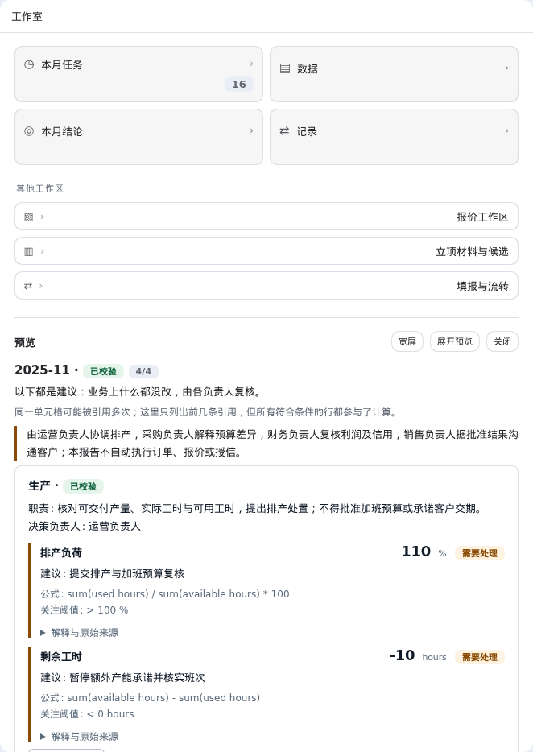

报告顶部先说清自己的边界：仅形成建议、未执行业务变更、模型解释须由业务负责人复核、
「引用 N 次」不等于 N 个不同单元格、展示封顶不等于只算了样本。先看这行，再看数字。

每张部门卡片给出：职责、决策负责人、指标与现值、建议动作、**公式**（照字典原文显示）、关注阈值。
展开「解释与原始来源」拿引用。

把一个数字追到底的正确做法：

1. 取现值，例如 排产负荷 110%。
2. 读它的公式：`sum(used hours) / sum(available hours) * 100`，关注阈值 `> 100%`。
3. 展开引用，记下文件、原始行号、原始列名。
4. 在左栏打开那份来源，跳到那一行。原始行号在去空、去重、隔离之后都不会重排，
   引用指向的位置和导入时一致。

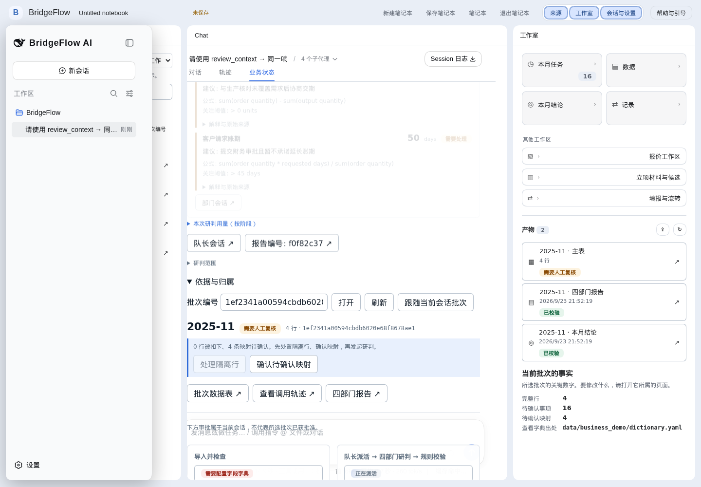

*2026-09-06 外壳。* 「业务状态」是这批数据的状态视图，不是工作流引擎：节点按实际发生的事高亮，
点击可筛选，页面上任何操作都不会替你执行业务动作。

把一个数追到单元格的例题见[第 16 节例 2](#16-例题从题目到答案)；同一套代码跑两个月份的对照在
[例 3](#16-例题从题目到答案)。

术语，以及术语里的坑：

| 记号 | 含义 | **不**等于 |
| --- | --- | --- |
| `needs_configuration` | 字典没声明所需内容 | 导入失败。它没失败 |
| `needs_review` | 有待确认映射等人 | 业务计算被禁止。本案例直接按声明列计算，映射待确认时也能出 validated 报告 |
| `validated` | 四部门判断都通过了字典校验 | 已批准、已签发、已执行 |
| `partial` | 至少一个部门没有有效判断 | 一个可以忽略的警告。它是最诚实的状态 |
| `attention` | 触及了声明的关注阈值 | 有人已经处理了它 |

## 11 人在环内：映射审批

把下面这句粘进会话（要的话换掉批次编号）：

> 请仅调用一次 confirm_mapping：source="sku:demo-review"，target="customer:demo"，
> relation="ordered_by"，accepted=true，evidence="合成案例的关系待负责人核对"，period="2025-11"。
> 等待原生审批；若拒绝，说明未写入并转述操作者理由，不重试。

工具调用会阻塞，原生审批面板弹出，里面能看到参数、一个可选的拒绝理由框（最多 240 字符）、
审批期限，以及两个按钮：拒绝、允许一次。

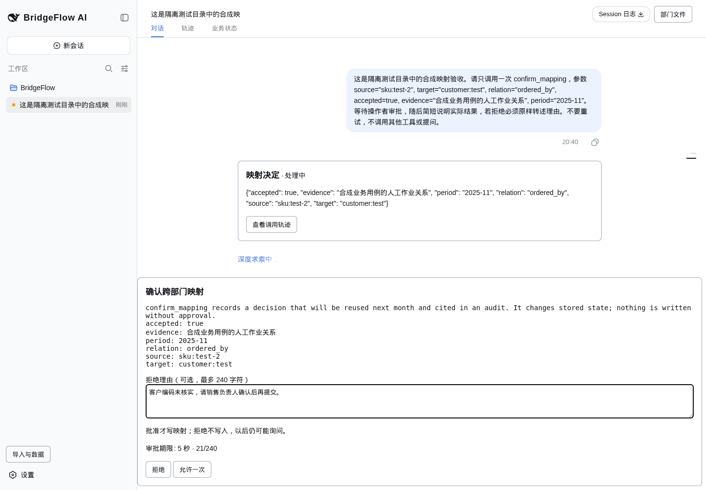

*2026-09-06 外壳。面板、理由输入与审计事件至今一致。*

- **允许一次**：写入一条映射规则，绑定**这一次**的参数——决定作出后由主机生成一次性回执，
  重放会被拒绝。
- **拒绝**：什么都不写。你填的理由会回传给模型，模型必须如实转述。工具结果里的措辞是
  「未写入，未来导入仍可能询问」。
- **无人应答**（超时）：同样什么都不写。生产默认 300 秒，自动化测试 5 秒，面板显示的是实际生效值。
  超时按 `cancelled` 记录，绝不写成「有人拒绝」：没人被问到时说「没人能决定」。
  编一个决策者出来，比原来那个 bug 更糟。

三种结局的完整走法、以及模型实际收到的那段文字，在[第 16 节例 4](#16-例题从题目到答案)。

台上最容易讲错的一点：工具参数里的 `accepted=false` 是「记录一项否定关系的决定」，
它本身仍是一次需要批准的写入；面板上的「拒绝」按钮是「不执行这次写入」。两件事，别混着说。

## 12 保存、离开、再回来

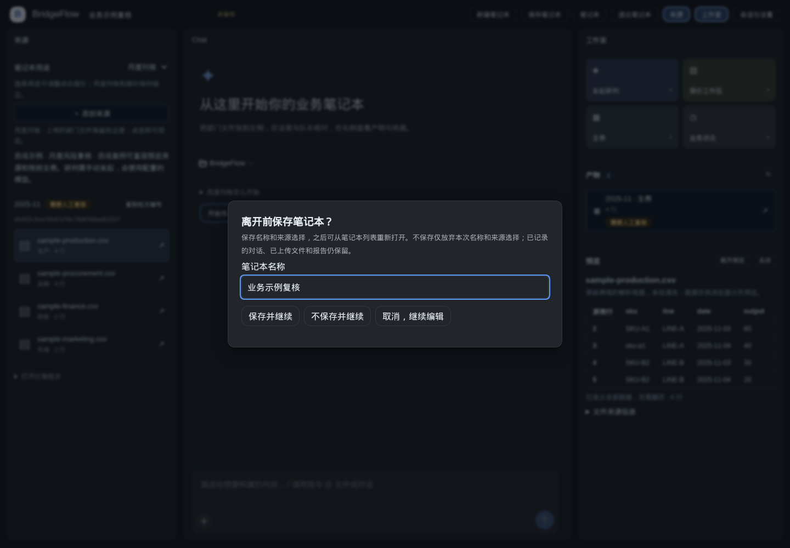

保存是显式的。改过名称、用途或来源再离开，会给你三个选择：保存并继续、不保存并继续
（只丢弃笔记本编辑，对话、已上传文件与已保存报告都留着）、取消并继续编辑。
只有原生标题与官方 storage-domain 都确认落盘，才显示「已保存」。保存失败会停在原页、保留输入、可重试。

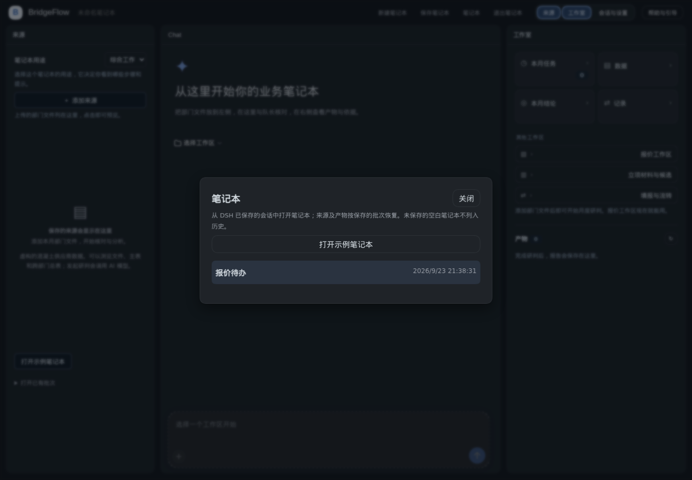

「笔记本」列表会恢复名称、用途、来源批次与你保存的预览位置。已经命名但没发过消息的笔记本在列表里；
部门子会话不在。

## 13 报价工作区

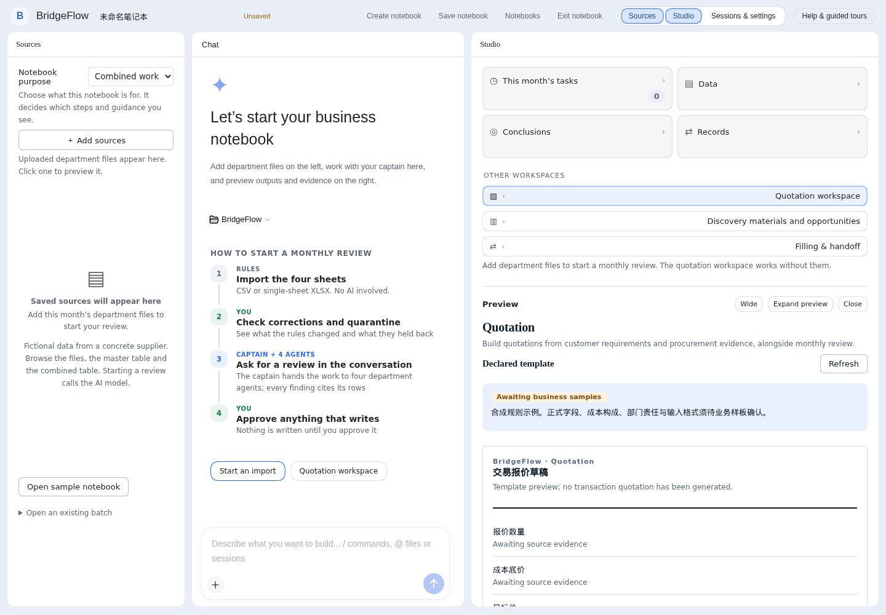

报价是月度对账**旁边**的第二条路径，不是转向。从工作室打开「报价工作区」，空会话也能直接打开。
你看到的是**声明出来的模板**：报价单会有哪些字段、哪些还标着「待补真实依据」、每条依据该谁给。
「等待业务样板」这个标记就是这个功能的真实状态：模板证明执行契约成立，它不是已获批准的报价政策。

`data/mock_business/quotation/` 是一套虚构但完整的商砼报价样板：客户询价记录、供货合同范本、标准报价单模板、
成本与产能依据、定价与信用政策、按政策写的报价声明、把每个输入指到原件章节或单元格的抽取记录，以及手算标准答案。
`backend/tests/test_mock_quotation.py` 会打开原件核对每个抽取值，确认草稿与手算答案一致、违反政策时拒绝。

还没做、界面上也没假装做了的：从真实合同或客户会话里自动抽取事实、把上传件变成已验证的事实集、
以及任何外发报价的入口。

### 填报与流转，以及三 Agent 工作流

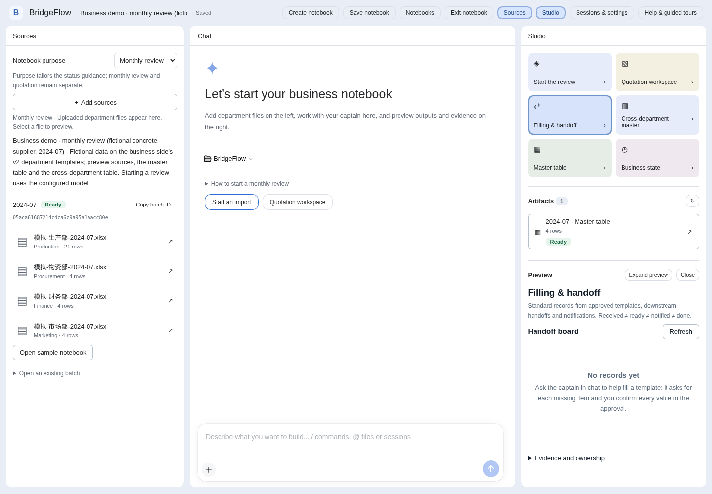

业务方设计了三个 Agent：**Agent 1** 读部门材料、提出候选工作场景、画信息流与文件流、做四象限立项提案，并记录各部门选定的 MVP；
**Agent 2** 把选定流程变成模板、辅助员工填写、把标准记录交给下一个部门；**Agent 3** 在落地阶段做上手指引并收集一线反馈。

现在有的是基座：声明式工作流目录、状态机与事件日志、通过 captain 带人补问填报（每次写入都要原生审批），
以及只读的「填报与流转」视图（交接看板、草稿待补项、字段血缘列表、落地信号）。Agent 1 的功能、下游操作（开始 / 退回 / 完成）、
真实通知和 Agent 3 都还没做。与设计的逐条对照和计划顺序见 [`HANDOFF.md`](HANDOFF.md)。


## 14 检查安装是否健康

```bash
cd backend && pytest -q && ruff check src tests ../scripts/start_web.py
cd ../plugins && pnpm run typecheck && pnpm test && pnpm run build
pnpm run smoke:web && pnpm run smoke:business
BRIDGEFLOW_TEST_FAULT=step-limit pnpm run smoke:business
```

预期：Python 与 TS 单测离线全绿，不调模型、不产生费用。

**已知是红的**：三条浏览器 smoke 目前在开发机上失败，控制台都是
`client-modules: HTML did not preload @deepseek-ai/dsh-client-modules/client.js`，
跟踪在 [#97](https://github.com/EricWang1358/BridgeFlow-AI/issues/97)。不是产品坏了：同一份补丁、
同一条 `dsh web` 命令，指向一个真实 `DSH_HOME` 就能正常渲染。修好之前，看界面请用
`pnpm --dir plugins shots`，别以为自己弄坏了什么。

「量到了什么、花了多少、哪些还没验证」一律看 [`docs/00-status.md`](docs/00-status.md)。

## 15 出问题的时候查这里

| 现象 | 实际发生了什么 | 怎么办 |
| --- | --- | --- |
| 导入成功、主表是空的、研判被拒绝 | 这批冻结的字典没声明可连接列，也没有研判契约 | 用 `--demo` 启动，或导出正确的 `FIELD_DICTIONARY_PATH`。面板会打印这批冻结了哪份字典 |
| 会话里说工具需要审批但没有审批通道 | 那个组合里够不到 approval | 走原生 Web 路径；不要加一个绕过用的 answerer |
| 跑过 Python 打包 SDK 之后建会话失败 | 共享 `DSH_HOME` 的模块 fallback 被改写成 `/snapshot` | 重启 `scripts/start_web.py`，官方启动器会自愈。直接试验 SDK 请另开独立 `DSH_HOME` |
| 旧会话日志打不开（`bridgeflow/review`、`bridgeflow/approval-note`） | 历史遗留的信息事件，原生冷读器不肯忽略 | 先停启动器，跑 `python scripts/repair_session_metadata.py --root ../.dsh-bridgeflow/sessions` 检查，认可后再加 `--apply`。它会保留原始字节备份 |
| Windows 浏览器连不上服务 | 服务绑在 `127.0.0.1`，或者主机不对 | 先用 `ss -tlnp` 看监听地址，再看 [`docs/14` 第 10 节](docs/14-wsl-setup.md) |
| 干什么都慢、watch 不重载 | 你在 `/mnt` 下 | 把仓库、venv 与 `DSH_HOME` 移进 Linux 文件系统 |
| 浏览器 smoke 报 client-modules 那句 | 已知未解问题，不是你改坏的 | 见 [#97](https://github.com/EricWang1358/BridgeFlow-AI/issues/97)；用 `shots` 看界面 |
| 本该出数的地方给了拒绝 | 数据不完整，系统拒绝猜 | 先照[第 16 节例 5](#16-例题从题目到答案)把四种情况各走一遍，再考虑改字典 |
| 两个面板对同一个数不一致 | 口径冲突是有可能的，历史上真发生过 | 按引用重新推导，然后把量结果记进 `docs/00` |


## 16 例题：从题目到答案

六道例题。每题给数据、给操作、给**实际跑出来的输出**，再说清容易读错在哪。
例 5 的四条拒绝信息是 2026-09-07 在本仓库 `main` 上跑出来的，不是设想。

### 例 1 判一个月：「2025 年 11 月健康吗？」

**已知。** `data/business_demo/risk/` 四份文件，月份 `2025-11`，字典 `data/business_demo/dictionary.yaml`。这些例题用的是较早的英文 CSV 回归案例（带独立标准答案，浏览器 smoke 也用它），不是示例笔记本的 v2 模板案例；启动时用 `FIELD_DICTIONARY_PATH=data/business_demo/dictionary.yaml`，不要加 `--demo`。

**操作。** 按第 8 步导入，按第 9 步发起研判，按第 10 步打开报告。

**看答案之前，先自己算一遍。** 这就是这个产品的意义：数字不是模型说的，是声明的公式作用在单元格上。

| 指标 | 字典里的公式 | 手算 |
| --- | --- | --- |
| `capacity_utilisation` | `sum(used hours) / sum(available hours) * 100` | (48+32+18+12) / (40+30+20+10) = 110/100 = **110%** |
| `capacity_headroom` | `sum(available) - sum(used)` | 100 - 110 = **-10 小时** |
| `material_spend` | `sum(unit price * qty)` | 12x10 + 12x20 + 20x10 + 20x10 = **760 SGD** |
| `purchase_budget` | `sum(budget price * qty)` | 10x10 + 10x20 + 20x10 + 20x10 = **700 SGD** |
| `purchase_price_drift` | `(spend - budget) / budget * 100` | 60/700 = **8.5714%** |
| `gross_margin` | `(sales - positive costs) / sales * 100` | (3000 - 3300)/3000 = **-10%** |
| `ar_weighted_days` | `sum(AR balance * AR days) / sum(AR balance)` | (800x60 + 600x30)/1400 = **47.1429 天** |
| `order_gap` | `sum(ordered) - sum(produced)` | 180 - 150 = **30 units** |
| `requested_terms_days` | `sum(qty * requested days) / sum(qty)` | (120x60 + 60x30)/180 = **50 天** |

**报告说什么。** 八条声明的 check 全部 `attention`：负荷超 100%、余量低于 0、支出高于同数量预算、
偏差高于 5%、毛利低于 0、加权账期高于 45 天、订单缺口高于 0、请求账期高于 45 天。
独立标准答案在 `data/business_demo/expected.json`；报告与它不一致，就是报告的缺陷，不是口味问题。

**坑在这里。** 报告自带的 `limitations` 也是答案的一部分：案例里没有 BOM 与库存，所以
「订单比产出多 30 件」**推不出**交付失败；那个偏差是同数量预算比较，不是月环比涨价；
47.1429 天的加权账期也不是坏账。看到「毛利 -10%」就写「计提损失准备」的人，已经把证据丢在后面了。

### 例 2 把一个数字追到单元格

**题目。** 110% 从哪来，你能证明吗？

在生产卡片上展开「解释与原始来源」，落盘的记录长这样：

```json
{"check_id": "capacity", "metric": "capacity_utilisation", "value": 110, "unit": "%",
 "formula": "sum(used hours) / sum(available hours) * 100",
 "source_count": 8, "source_count_basis": "formula input cell occurrences", "truncated": true,
 "threshold": 100, "attention_when": "above", "expected_status": "attention",
 "action": "提交排产与加班预算复核", "explanation_status": "model_advice",
 "execution_status": "proposed_only"}
```

按这个顺序读：

1. `source_count: 8` 是四个 `used_hrs` 加四个 `available_hrs`，正好是公式的输入量。
   `truncated: true` 只说明展示最多列 5 条，不代表计算用了样本。
2. 列出的引用带 `filename`、`source_row`、`original_column`：production.csv 第 2 到 5 行、
   `used_hrs` 列。在左栏打开那个文件，你看到的就是那些格子。
3. `action` 不是模型写的：它是声明的 check 在 `attention` 分支下的动作原文。
4. `explanation_status: "model_advice"` 标出那一句**确实**是模型 prose。两种权威，卡片上颜色也不同。
5. `execution_status: "proposed_only"`：没有下单、没有排产、没有授信。

**坑。** 「引用 8 次」也不等于「8 个不同单元格」：同一格被公式用两次就计两次。
这个数统计的是输入次数，不是位置数。

### 例 3 同一套代码，两个月份：risk 与 balanced

把 `balanced/` 作为新批次导入再研判。代码一行没变，变的是数据。

| 指标 | risk | balanced |
| --- | --- | --- |
| 工时负荷 / 剩余工时 | 110% / -10 h | 80% / +20 h |
| 支出 / 预算 / 偏差 | 760 / 700 / +8.5714% | 700 / 700 / 0% |
| 销售 / 正数成本 / 毛利 | 3000 / 3300 / -10% | 3000 / 2000 / +33.3333% |
| 加权应收账期 | 47.1429 天 | 30 天 |
| 订单缺口 / 请求账期 | +30 units / 50 天 | -20 units / 30 天 |
| 八条 check 状态 | attention | ok |

**两个坑。** 一，`ok` 不等于「没风险」：balanced 仍然有 -20 件的订单缺口和一条未获批准的 30 天请求，
只是都没越过阈值。二，之后重开 risk 那一批：它逐字节没变。新导入从不重算旧批次，
这正是批次不可变的全部理由。

### 例 4 映射审批的三种结局

**出题。** 在会话里粘第 11 步那句话：请求一次 `accepted=true` 的 `confirm_mapping`
（`sku:demo-review` 到 `customer:demo`），然后等。

**结局 A，允许一次。** 写入发生，映射记忆里多一条规则，并记下是谁批准的；下次导入直接应用，不再问。

**结局 B，拒绝并填理由。** 例如「客户编码未核实，请销售负责人确认后再提交。」什么都不写。
模型收到的工具结果是我们写的，它把事实说清了：

```text
confirm_mapping did NOT run: a person reviewed it and refused. The reviewer said:
"evidence is stale - use the October BOM, not this one". Nothing was written, ...
```

模型随后必须转述这句话。评审时它说过「下个月不会再问」，那是假的，所以现在措辞明确写
「未来导入仍可能询问」，真实模型复测会把这句话和文件对一遍。

**结局 C，无人应答。** 同样什么都不写，叙述说的是「没人能决定」。它不会说成「有人拒绝」。
`cancelled`、`unavailable`、`rejected` 是三个不同的事实。

**最贵的坑。** `accepted=false` 不是「拒绝」。它的意思是「记录一项否定关系的决定」，
本身仍是一次需要批准的写入；面板上的「拒绝」是「这次调用不执行」。这两句说不清，台上就会把自己的产品讲错。

### 例 5 系统拒绝出数的四种数据

把 `data/business_demo/risk/` 复制到一个临时目录，改坏一个格子，导入副本，点「发起研判」。
下面每一条都是这套代码真实返回过的信息（接口上是 `/tools/review-context` 的 409，面板显示同一句）。

| 改坏什么 | 屏幕上出现 | 为什么是拒绝，而不是少报一点 |
| --- | --- | --- |
| 某一行采购 `price` 留空 | `Declared numeric cell is missing or unreadable` | 把 760 报成 640，就把「至少花了这么多」变成了「正好花了这么多」 |
| 某一行采购币种写成 USD | `procurement: currency missing or mismatched; conversion is not configured` | 没有声明的汇率规则，任何总额都是编一个汇率出来 |
| 成本写成 -2000 | `finance: cost violates the declared nonnegative convention` | 字典声明成本为正数；混进负数会改变 `sales - cost` 的含义 |
| 日期写成 `03/11/2025` | 导入：production 保留 3 行、**隔离 1 行、修正 1 处**；研判：`Resolve batch configuration or quarantined rows and import a new batch before review` | 这是 11 月 3 日还是 3 月 11 日？猜过一次，那行进了错误的月份，总额跟着错（#79）。现在原文留在隔离区，整批拒绝报总额 |

**修法不是「让它少接受一点」。** 修源文件，然后导入新批次。旧批次作为「当初问了什么」的证据保留。

**坑。** 拒绝不是演示坏了。屏幕上出现拒绝时，诚实的做法是把拒绝和缺什么一起展示出来；
不诚实的做法是把那一行删掉。

### 例 6 一次部分失败的研判，以及人工意见不能做什么

**离线复现，不花钱：**

```bash
BRIDGEFLOW_TEST_FAULT=step-limit pnpm --dir plugins smoke:business
```

财务子会话连续三次输出无效结构，撞到步骤上限停下。报告是 `partial`：财务没有有效判断，
其余三个部门保留各自结论，孩子数量仍是 4（四个会话真的起过，一个失败了）。
然后在 partial 页面提交人工复核意见：它以普通聊天消息到达队长，报告仍是 `partial`，
意见不替财务签字。

**已知缺口，直说：** 「不得重跑」目前只是文本要求，不是宿主级限制；端到端超时与重启恢复未完成
（[docs/19](docs/19-chain-audit.md) 里列为 P0）。不要把 partial 讲成「已经处理了」。

**坑。** 用一句看着合理的话补上缺失的部门，会让报告看起来很完整，而这恰恰是这个产品最不能做的事：
审批人签的是一个没人算出来的数。

## 真正的文档在哪里

| 你要找 | 去哪 |
| --- | --- |
| 当前进度、下一步、已知缺陷 | [`HANDOFF.md`](HANDOFF.md) |
| 每一个实测数字与它的复现命令 | [`docs/00-status.md`](docs/00-status.md)，唯一来源 |
| 架构为什么长成这样 | [`docs/13-golden-standard.md`](docs/13-golden-standard.md) |
| 动手前要读的硬约束 | [`CLAUDE.md`](CLAUDE.md) |
| 演示脚本与台上今天能不能跑 | [`docs/04-demo-plan.md`](docs/04-demo-plan.md)、[`docs/17`](docs/17-business-mvp-acceptance.md) |
| 哪个问题该翻哪篇 | [`docs/README.md`](docs/README.md) |

架构一块，给没耐心的人：

```text
官方 DSH Web：原生对话、会话、审批、轨迹
  └─ BridgeFlow 槽位：导入与数据、拒绝理由、报告卡
       └─ 类型化领域工具 + 主机策略
            ├─ Python：不可变批次、字典、算术、校验
            ├─ 官方 DSH spawn：生产 / 采购 / 财务 / 市场
            └─ 原生审批 → 一次性回执 → 映射记忆
```

仓库布局：

```text
backend/          Python 领域计算、持久化与私有 FastAPI 服务
plugins/          DSH 工具、护栏、原生审批接入与 Client UI 槽位
dsh/              锁定的 Web 策略补丁与受限分析员 preset
scripts/          原生 Web 启动器与运行时检查
data/samples/     历史开发用表格
data/business_demo/ 英文 CSV 回归案例与独立标准答案（浏览器 smoke、例题）
data/company_templates/ 业务方 v2 模板、字典与整合声明
data/mock_business/ 虚构月度导出、示例笔记本案例与报价样板
examples/         独立演示（生产部 → 市场部交接 MVP）
docs/images/      本指引使用的截图
docs/             需求、架构、实测状态与评审
```

状态：带真实模型与浏览器证据的业务用例演示 MVP。真实客户数据与企业部署仍待验证。
工作在[项目看板](https://github.com/users/EricWang1358/projects/1)上跟踪。

部署是刻意没配的：没有 Dockerfile，没有 CI。目标还没定，而在此之前先加这两样，
是本仓库已经犯过一次的那个错误。