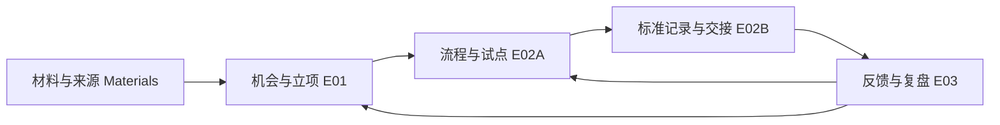

# BridgeFlow 全项目需求、用例与实施计划 / Project requirements, use cases and delivery plan

2026-09-16 核对 GitHub issue 正文及评论，并检查 `main@4a38904` 代码。Git 从 `a891131` 快进至该版本；没有覆盖本地改动。当前工作在 `feat/14x-requirements-delivery`。

Reviewed issue bodies/comments and code at `main@4a38904` on 2026-09-16. The clean checkout was fast-forwarded from `a891131`; implementation is on `feat/14x-requirements-delivery`.

该分支已于 #187 合入主干。2026-09-17 按「项目完整性、流程便民性、结论直观性与专业性」三个视角复核，补充了共用基础、E13、E14 与类设计，并把全部 UC 的套话参与者与触发事件改为具体描述，见 [00-foundations](00-foundations.md)。后续接手顺序见 [HANDOFF](../../HANDOFF.md)；这不表示全部 UC 完成。

The branch was merged in #187. On 2026-09-17 the catalogue was reviewed for completeness, ease of use and the clarity and professionalism of conclusions; foundations, E13, E14 and a class design were added and every UC's boilerplate actor and trigger was replaced. See [00-foundations](00-foundations.md) and [HANDOFF](../../HANDOFF.md); this is not full UC completion.

## 全项目范围与 14x 的关系 / Project scope and the 14x subset

以 [#127](https://github.com/EricWang1358/BridgeFlow-AI/issues/127) 最新分工为准：先发现机会并批准 MVP，再细化流程及标准，最后形成组织采用闭环。#143 早期把最终字典放在 Agent 1 的描述，已由 #127 调整至 Agent 2A。2A/2B 是一个 epic 内的两个阶段。旧 #131 知识问答和 #135 技术运维不等于这里的 Agent 2/3。

The latest #127 allocation takes precedence over earlier issue wording: discover and approve scope, design and execute standards, then support organizational adoption. Agent 2A and 2B are phases of one epic. Legacy knowledge Q&A (#131) and operations (#135) are separate capabilities.

| Epic | 文件 / File | 范围 / Scope |
| --- | --- | --- |
| E01 / #143 | [立项发现 / Discovery](01-discovery.md) | 材料、候选、图、四象限、会议与 MVP 决策 / materials, opportunities, diagrams, quadrants, meetings and decisions |
| E02 / #144 | [标准化与流转 / Standardization](02-standardization.md) | 2A 流程和模板试点；2B 补问、入库、通知及交接 / workflow and pilot; clarification, submission, notification and handoff |
| E03 / #145 | [组织落地 / Adoption](03-adoption.md) | 岗位指引、一线反馈、资源建议及复盘 / guidance, feedback, resources and review |

一个文件对应一个 epic，文件内同时维护中文和英文。上表仅为 14x 的 3 个 epic、21 个 UC，不是全项目总量；#125 对应 E01-UC04，#140 对应 E02-UC10，#141 对应 E02-UC09，#147 是固定案例的历史证据，不是完整验收。

Each epic has one bilingual file. The table above covers only the 14x subset: 3 epics and 21 UCs, not the whole project. #125 maps to E01-UC04, #140 to E02-UC10, #141 to E02-UC09; #147 is historical evidence for a fixed demonstration, not full acceptance.

## 全项目盘点 / Full project inventory

截至 2026-09-17，目录共有 **14 个 epic、85 个 UC**：14x 主线 3 个 epic / 21 UC，既有能力及历史范围 9 个 epic / 52 UC（2026-09-16 补录），以及结论呈现与流程便民 2 个 epic / 12 UC（2026-09-17 新增）。既有实现按用户目标归类，工具、接口和测试本身不各算一个 UC。原 E01–E03 编号保持不变。

As of 2026-09-17, this directory contains **14 epics and 85 UCs**: 3 epics / 21 UCs for the 14x track, 9 epics / 52 UCs for existing capabilities and historical scope (added 2026-09-16), and 2 epics / 12 UCs for conclusions and monthly convenience (added 2026-09-17). Grouping follows user goals, not a separate UC per tool/endpoint/test. E01–E03 IDs are unchanged.

| Epic | 文件 / File | UC 数 / Count |
| --- | --- | ---: |
| E01 | [立项发现 / Discovery](01-discovery.md) | 6 |
| E02 | [标准化与流转 / Standardization](02-standardization.md) | 10 |
| E03 | [组织落地 / Adoption](03-adoption.md) | 5 |
| E04 | [数据导入、清洗与隔离 / Data intake, cleaning and quarantine](04-intake-quality.md) | 8 |
| E05 | [字段字典、语义匹配与记忆 / Dictionaries, semantic matching and memory](05-mapping.md) | 6 |
| E06 | [总表整合、口径核对与导出 / Master integration, reconciliation and export](06-master-integration.md) | 6 |
| E07 | [确定性指标与四角色研判 / Deterministic metrics and four-role review](07-review.md) | 7 |
| E08 | [声明式报价与签发 / Declared quotation and release](08-quotation.md) | 5 |
| E09 | [身份、授权、审批与安全边界 / Identity, authorization, approval and safety](09-security-approval.md) | 6 |
| E10 | [原生工作室、笔记本与使用引导 / Native workspace, notebooks and onboarding](10-workspace.md) | 6 |
| E11 | [运行维护、评测与交付 / Operations, evaluation and delivery](11-operations-evaluation.md) | 5 |
| E12 | [历史知识库与问答范围 / Historical knowledge and Q&A scope](12-knowledge-deferred.md) | 3 |
| E13 | [月度结论呈现与口径治理 / Monthly conclusions, presentation and convention governance](13-conclusions.md) | 6 |
| E14 | [月度流程便民 / Monthly workflow convenience](14-monthly-convenience.md) | 6 |

共用基础不定义 UC / Shared foundations define no UCs: [00-foundations](00-foundations.md)（角色目录、逐 UC 参与者与触发、非功能需求、结论呈现规范、优先级与验收写法 / actors, per-UC actors and triggers, quality attributes, presentation standards, priority and acceptance format）；[class-design](class-design.md)（E13/E14 类设计与模式 / class design and patterns）。

### 状态汇总 / Status totals

| Status | UC 数 / Count |
| --- | ---: |
| IMPLEMENTED | 38 |
| IMPLEMENTED_OFFLINE | 11 |
| PARTIAL | 21 |
| DESIGNED | 7 |
| BLOCKED_EXTERNAL | 3 |
| DEFERRED | 5 |

IMPLEMENTED 与 IMPLEMENTED_OFFLINE 均不等于真实企业验收。历史知识库和完整自动运维等延期项计入需求总数，但不计为已实现。编号文件定义 UC；本 README 与追溯表只做索引，不重复计数。

Neither IMPLEMENTED nor IMPLEMENTED_OFFLINE means enterprise acceptance. Deferred knowledge/operations requirements remain in the inventory but are not delivered features. Only numbered epic files define UCs; indexes do not add to the count.

[完整追溯矩阵 / Full traceability matrix](traceability.md) 覆盖 PRD FR01–26 和本轮读取的全部 GitHub issue，并区分关闭、延期和实现状态。

## 状态 / Status vocabulary

| Status | 含义 / Meaning |
| --- | --- |
| IMPLEMENTED | 已有实现及可定位验证资产；本轮为盘点，不声称全新复跑或业务签核 / existing implementation and traceable verification assets; audited, not necessarily rerun or business-accepted |
| DEFERRED | 历史需求保留，本期未交付或范围排除；不算已实现 / retained historical scope, not delivered in this phase |
| DESIGNED | 已分析并设计，未实现 / analyzed and designed, not implemented |
| PARTIAL | 有代码，但 UC 尚有功能或验收缺口 / code exists with functional or acceptance gaps |
| IMPLEMENTED_OFFLINE | 所列本地实现与行为验证通过；真实验收另列 / listed local implementation verified; real acceptance is separate |
| BLOCKED_EXTERNAL | 需要业务样例、凭据、接口或签核；不暗示其余代码已完成 / external inputs needed; does not imply all code is complete |
| ACCEPTED | 业务负责人依据明确版本与证据签核 / business owner accepted a specific version with evidence |

[全项目未完成边界的实施顺序与外部输入](implementation-plan.md) / [Implementation order and external inputs](implementation-plan.md).

## 14x 还需要几步 / Remaining delivery sequence for 14x

以下仅是 14x 的八个可验收工作包；存量缺口以各 epic 及追溯矩阵为准。它们不是八次工具调用，也不是未经估算的工期承诺。一个工作包可能需要多次提交。

These are eight verifiable work packages, not eight commands or a delivery-time commitment.

| Step | 内容 / Work | 退出条件 / Exit condition | 依赖 / Dependencies |
| --- | --- | --- | --- |
| 1 | 需求基线 / Requirements baseline | 三个双语 epic、稳定 UC ID、证据及设计 / bilingual epics, stable IDs, evidence and design | 本轮已整理 / documented in this change |
| 2 | 材料与候选 / Materials and opportunities | 版本化材料清单、来源、候选、未确认问题 / versioned inventory, references, opportunities and unknowns | 代表性业务链材料 / representative workflow materials |
| 3 | 图、四象限与决策 / Diagrams, quadrants and decisions | 可查看依据、保存会议及条件式决策 / inspectable evidence and recorded conditional decisions | 量表、投票规则与业务确认 / scales, voting rules and business confirmation |
| 4 | 模板与试点 / Templates and pilot | 试点反馈驱动修订、批准版本和指标 / pilot-driven revisions, approvals and metrics | 一线参与、调优样例 / frontline participation and tuning data |
| 5 | 运行时闭环 / Runtime completion | 下游审批操作、修订保护和明确状态 / approved handoff actions, revision guards and explicit state | 已有基座 / existing foundation |
| 6 | 组织闭环 / Adoption loop | 岗位指引、反馈、处置、复盘及回流 / guidance, feedback, triage, review and routing | 支持角色与可读信息范围 / support roles and data scope |
| 7 | 真实接入与独立评测 / Live integration and held-out evaluation | 一个真实目标、飞书文件验证、独立留出结果 / one real target, Feishu file verification, held-out results | #140/#141 与目标系统 / credentials, data and target system |
| 8 | 用户旅程验收 / User-journey acceptance | 浏览器+真实对话+业务签核，逐 UC 更新 / browser, live conversation and owner sign-off with UC updates | 前述能力及真实模型预算 / preceding capabilities and live-model budget |

## 公共设计 / Shared design

对象关联建议：`Opportunity → ProjectDecision → WorkflowVersion/TemplateVersion → PilotFeedback → Artifact/SubmissionReceipt/Handoff → ImprovementItem`。前四类治理对象和 ImprovementItem 的持久工作流尚待实现；不能把已有 catalogue YAML 当作完整治理 UI。

Proposed object chain: opportunity → project decision → workflow/template version → pilot feedback → artifact/receipt/handoff → improvement item. Governance persistence and improvement lifecycle remain work; catalogue YAML is not a governance UI.

所有业务标准来自人工声明；AI 可以提出草案但不能发布标准。沿用 [架构权威](../13-golden-standard.md) 与 [工作流基座](../25-workflow-foundation.md)。现有门户登录不自动赋予新 workflow 接口部门级隔离；正式开放给企业前要逐端点验证访问范围。

Business standards remain human-authored; AI may propose but cannot publish them. Follow the architectural authority and workflow foundation. Portal login does not automatically provide department isolation for new workflow endpoints; validate scope per endpoint before enterprise exposure.

## 外部输入与完成边界 / External inputs and completion boundary

尚需：业务链原件、人工规则及两组调优数据；独立保管的留出集（开发不得查看）；模板试点参与者与批准角色；评分/投票规则；首个目标接口、字段映射与测试环境；飞书测试配置；支持入口与角色；真实模型验收预算。详见 [外部输入清单](../27-external-inputs.md)。

Still needed: representative originals, human rules and two tuning sets; independently held-out evaluation data; pilot participants and approvers; scoring/voting rules; a target API, mappings and test environment; Feishu test configuration; support entry/roles; live-model acceptance budget. See the external-input checklist.

这些缺口不妨碍本地文档、实现和离线测试，但不允许把模拟结果写成真实业务通过。实现与测试证据记录在 [docs/00](../00-status.md)，本目录仅维护 UC 交付状态，不重复保存漂移的测试数字。

These gaps do not prevent documentation, local implementation or offline tests. They do prevent declaring simulated results as real business acceptance. Measured evidence belongs in docs/00; this directory tracks UC delivery state.
