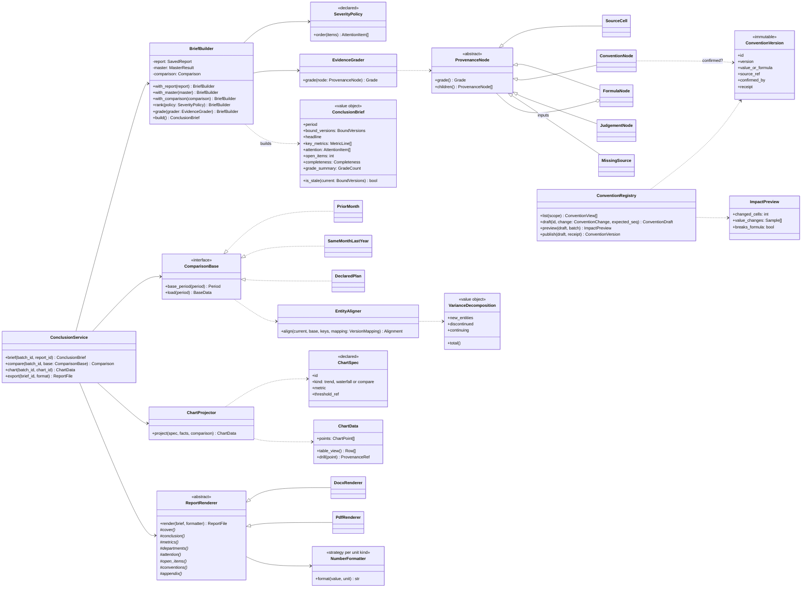
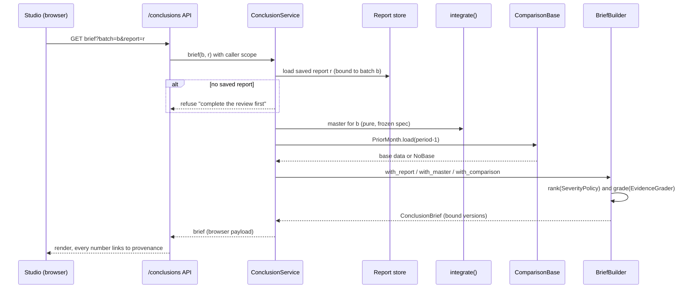
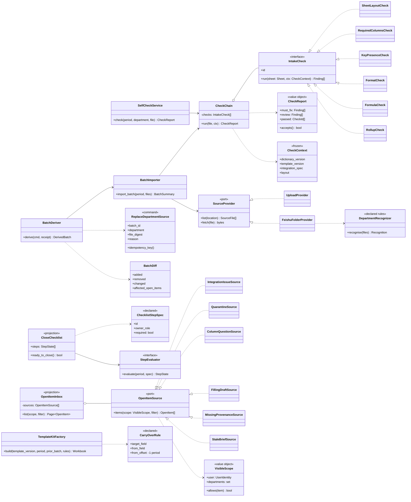
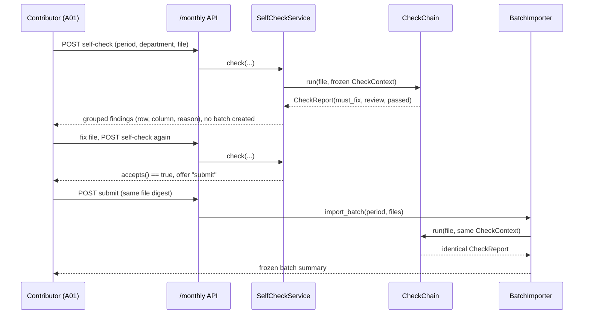

# E13 / E14 类设计与模式 / Class design and patterns for E13 and E14

基线 / Baseline: `692d3d5`, 2026-09-17. 需求见 [E13](13-conclusions.md) 与 [E14](14-monthly-convenience.md)；共用约束见 [00-foundations](00-foundations.md)、[架构权威](../13-golden-standard.md) 与 [工作流基座](../25-workflow-foundation.md)。

本文是待实现设计，不表示这些类已经存在。类名是建议，落地时以代码评审为准；约束与不变量不可省略。

This is a design for work not yet implemented. Class names are proposals; the constraints and invariants are not optional.

## 1 设计原则 / Principles

| # | 原则 / Principle | 来自 / Source | 在本设计中的体现 / How it shows here |
| --- | --- | --- | --- |
| P1 | 依赖只向内：API → 用例服务 → 领域模块 / dependencies point inward | docs/25 | 新增 `conclusions/` 与 `monthly/` 两个领域包，API 只调用例服务 |
| P2 | 字段名、口径、阈值、图表、步骤全部来自声明，代码里没有业务名称 / everything business-specific is declared | CLAUDE.md | 严重度、比较基准、图表、清单步骤、沿用规则、部门识别都是声明对象；沿用 AST 测试禁止业务名进入代码 |
| P3 | 状态与算术由确定性代码负责，模型只提议与解释 / deterministic state and arithmetic | docs/13 | 结论页、对比、等级、清单、收件箱、预填均不调用模型 |
| P4 | 读模型是投影，不保存第二份真相 / read models are projections | docs/25 CQRS | 结论页、进度清单、收件箱、等级都从来源重新计算；只保存「生成了哪个版本」 |
| P5 | 写入不可变、可追溯、幂等，需要审批回执 / immutable, idempotent, approved writes | E09、docs/25 | 口径版本发布与单部门补传是带幂等键的命令，经原生审批 |
| P6 | 拒绝优于猜测，并给出可操作原因 / refuse rather than guess | CLAUDE.md | 无基期、版本不匹配、出处缺失、上期隔离值都显式拒绝或标注 |
| P7 | 工具返回有界 / bounded tool returns | CLAUDE.md | 给代理的只是计数、标识与有限样本；完整结论页与图数据只给浏览器 |

## 2 E13：结论呈现与口径治理 / Conclusions and conventions

### 2.1 类图 / Class diagram

### 2.2 模式与理由 / Patterns and rationale

| 模式 / Pattern | 类 / Classes | 为什么 / Why | 守住的约束 / Constraint protected |
| --- | --- | --- | --- |
| Builder | `BriefBuilder` → `ConclusionBrief` | 结论页由报告、总表、对比、排序、等级分步组装；partial 报告与缺少基期时部分步骤要跳过，Builder 让每步可单独测试 | P3：组装过程无模型调用 |
| Value object | `ConclusionBrief`、`VarianceDecomposition` | 结论页不可变，绑定来源版本；`is_stale` 比较版本而不是时间 | P4：不保存第二份真相 |
| Strategy | `ComparisonBase`（上月、去年同期、计划） | 比较基准会增加（例如预算），每种基准取数方式不同，但对齐与分解逻辑相同 | P6：计划值无来源时 `DeclaredPlan` 拒绝 |
| Specification（声明） | `SeverityPolicy`、`ChartSpec` | 严重度排序与图表选择是业务口径，必须声明，不能写死或由模型临时决定 | P2 |
| Composite + Visitor | `ProvenanceNode` 族、`EvidenceGrader` | 一个数字的依据是树：公式节点包含输入节点；等级为子树最弱一级，递归天然适合组合模式；把计算放在访问者里，节点类型保持简单 | NFR06 可追溯；`MissingSource` 让断链显式可见 |
| Template Method | `ReportRenderer` | 报告章节顺序固定（E13-UC04 验收），格式不同；模板方法锁定顺序，子类只管排版 | 章节缺失会导致抽象方法未实现，编译期或测试期即暴露 |
| Strategy | `NumberFormatter` | 00-foundations §5.1 按单位类型格式化，界面、导出与模型叙述共用同一实现，避免三处写法漂移 | 呈现规范一致 |
| Versioned aggregate + optimistic concurrency（已实现为 `conclusions/conventions.py`） | `ConventionDecision` 追加日志、`ConventionView` 投影 | 口径确认必须保留历史、来源与确认人；并发修改按 `expected_version` 冲突拒绝（E13-UC05 AC-4）。实现时按 `_write` 的原子写落一份 JSON/口径，不引入第二套存储 | P5；无来源拒绝、版本冲突拒绝均在领域层 |
| Command（审批绑定） | `decide(...)` 经 `/tools/convention-decide` + `consume_approval` | 决定是写操作，需要一次性回执并记下审批人为决定人；预览是无副作用的 dry run，复用纯函数 `integrate` | E09-UC01；冻结批次不被改写 |
| 刻意不做 / Deliberately absent | 「自动生成新声明版本草案」 | 需求主流程这样写，但声明文件由人维护（CLAUDE.md「字典由人预设」）。系统据自由文本重写 `derived` 树等于让模型发明声明；改为记录决定并给出该改的那一行（13-conclusions D8） | P2：字段与口径只来自声明 |

### 2.3 时序：生成一页结论 / Sequence: build the brief

给 captain 的工具版本只返回标题、关键指标值、关注项计数与等级分布，不返回单元格或完整出处树（P7）。

The captain-facing tool returns only the headline, key metric values, attention counts and the grade distribution, never cells or full provenance trees (P7).

## 3 E14：月度流程便民 / Monthly convenience

### 3.1 类图 / Class diagram

### 3.2 模式与理由 / Patterns and rationale

| 模式 / Pattern | 类 / Classes | 为什么 / Why | 守住的约束 / Constraint protected |
| --- | --- | --- | --- |
| Chain of Responsibility / Composite | `CheckChain` + `IntakeCheck` 族 | 现有检查散落在 `_read_xlsx`、清洗器与 `integrate` 中；抽成一条链后，自检与正式导入调用**同一个对象**，E14-UC03 AC-3「两者完全一致」由结构保证，而不是靠两份代码同步 | P6；检查规则全部读 `CheckContext` 中的声明，P2 |
| Facade | `BatchImporter` | 把现有 `_import_batch` 过程收拢为用例对象，对外接口不变；内部换成检查链、清洗、冻结三步 | P1；不破坏现有 API 与测试 |
| Command + idempotency key | `ReplaceDepartmentSource`、`BatchDeriver` | 补传是改变批次版本链的写操作；幂等键 =（原批次、部门、文件摘要），重复提交返回同一派生批次，与隔离处置的派生语义一致 | P5；原批次永不改写（E14-UC04 AC-2） |
| Memento / immutable lineage | 派生批次记录 `derived_from` 与替换原因 | 版本链可回溯，报告可判断自己绑定的批次是否已被取代 | NFR06 |
| Specification（声明）+ Strategy | `ChecklistStepSpec` + `StepEvaluator` | 每月需要哪些步骤是公司流程，必须声明；各步骤取状态的方式不同（批次、总表、报告），用策略隔离；读取失败返回 `Unknown`，不是 `Done` | P2、P6 |
| CQRS projection | `CloseChecklist`、`OpenItemInbox` | 两者只读、跨模块聚合；不持有自己的状态，原模块处理后自动消失（E14-UC05 AC-3），避免两处状态不一致 | P4 |
| Ports & Adapters | `OpenItemSource` 各适配器；`SourceProvider`（上传、飞书文件夹） | 新增待办来源或文件来源不改聚合与导入逻辑；飞书未配置时适配器返回「未配置」，与 `UnconfiguredSink` 同一做法 | E09 访问范围在每个适配器内按 `VisibleScope` 过滤，计数只算可见项 |
| Factory | `TemplateKitFactory` | 预填模板由批准模板版本、上期批次与声明沿用规则共同决定；工厂集中处理「无上期」「上期隔离」等拒绝分支 | P2、P6 |

### 3.3 时序：自检与正式提交共用检查链 / Sequence: self-check and submission share one chain

`CheckContext` 在一次自检中冻结声明版本；提交时若声明版本已变化，提交返回「声明已更新，请重新自检」，而不是用新规则静默导入。

`CheckContext` freezes declaration versions; if they changed before submission, submission asks for a new self-check instead of silently importing under new rules.

## 4 包结构与现有代码的关系 / Packages and existing code

| 新包 / New package | 内容 / Contents | 复用 / Reuses | 不改动 / Leaves untouched |
| --- | --- | --- | --- |
| `bridgeflow/conclusions/` | `service`, `brief`, `comparison`, `provenance`, `charts`, `report`, `formatting`, `conventions` | `integrate`、已保存报告、`WorkflowStore` 的版本与 `ConcurrencyError`、`consume_approval` | 研判流程、指标计算、总表口径 |
| `bridgeflow/monthly/` | `checks`, `selfcheck`, `importer`, `derive`, `checklist`, `inbox`, `templates`, `sources` | `_read_xlsx`/`Layout`、清洗器、`integrate`、隔离派生、飞书客户端、`UserIdentity` 与 `access.departments_for` / `workflow_departments_for` | 批次存储格式、现有 `/batches` 契约 |

前端：结论页、图表、收件箱与清单放在工作室，作为新的只读视图；图表渲染按 `ChartData` 声明选择组件，不在客户端重新计算数值。

Frontend: the brief, charts, inbox and checklist are new read-only Studio views; chart components render `ChartData` and never recompute values client-side.

## 5 测试策略 / Test strategy

| 对象 / Object | 行为测试 / Behavioral tests |
| --- | --- |
| `BriefBuilder` | partial 报告排除缺失部门；无报告拒绝；报告版本变化后 `is_stale`；模型调用计数为 0 |
| `EntityAligner` / `VarianceDecomposition` | 三部分之和等于总变化（性质测试）；无基期、基期为 0、字典版本不匹配的拒绝 |
| `EvidenceGrader` | 取最弱等级；口径确认后从 G3 升 G2；断链为 `MissingSource` |
| `ReportRenderer` | 8 个章节齐全且顺序固定；每个正文数字有出处编号；过期结论页拒绝导出 |
| `ConventionRegistry` | 无来源替换拒绝；并发冲突拒绝；发布需回执；冻结批次不变 |
| `CheckChain` | 同一文件自检与导入报告逐项相等（对照测试）；每类检查的拒绝样例；业务名不进入代码（沿用 AST 测试） |
| `BatchDeriver` | 相同文件不派生；幂等键重复返回同一批次；原批次不变；月份或部门不一致拒绝 |
| `CloseChecklist` / `OpenItemInbox` | 读取失败为 `Unknown`；部门范围过滤含计数；原模块处理后消失；收件箱无决策操作 |
| `TemplateKitFactory` | 上期值预填并标注；无上期或上期隔离不预填；表头与批准版本一致 |

## 6 两轮润色记录 / Two polishing passes

本轮需求与设计文档经过两遍润色，记录实际发现与修改，便于评审复核。

Both the requirements and this design went through two polishing passes; findings and changes are recorded for reviewers.

| 轮次 / Pass | 检查方法 / Method | 发现并修正 / Found and fixed |
| --- | --- | --- |
| 1 事实与一致性 / Facts and consistency | 脚本比对索引与正文状态、README 汇总、相对链接、foundations 映射表与 E13/E14 正文；逐项核对引用的模拟数据与代码名；浏览器实际渲染全部 mermaid 图 / scripted status, totals, link and mapping checks; cited data and code names verified; all mermaid diagrams rendered | E13-UC05 映射表漏了审批人（A06）；E13-UC06 触发句两处措辞不一致；类图引用了代码中不存在的 `AccessScope`，改为由现有 `UserIdentity` 与 `access.departments_for` / `workflow_departments_for` 构造的新值对象 `VisibleScope`；时序图消息中的分号导致 mermaid 解析失败；类成员中的竖线写法有渲染风险。状态 85 个与汇总一致，链接全部有效，6 月实际量 5,650 与 7 月环比 −40% 属实 |
| 2 用词与专业性 / Wording and professionalism | 扫描不可测或模糊表述，逐节通读 / scanned for vague or untestable phrasing and read every section | 「保存一定期限」改为按配置保留期限并到期删除；「尽量完成」改为未完成须写入限制；关键指标改为「声明为关键指标的 3–5 个」，避免系统自行挑选；AC-2 补上声明阈值 −20% 与实际降幅约 40%；状态用词表增加与系统状态值（`ok`、`attention`、`partial` 等）的对照列；E13/E14 英文参与者统一为「角色名 (编号)」；设计上确认自检与导入共用 `CheckChain`、结论页只保存绑定版本、所有业务口径均为声明对象、给代理的工具只返回计数与标识 |
